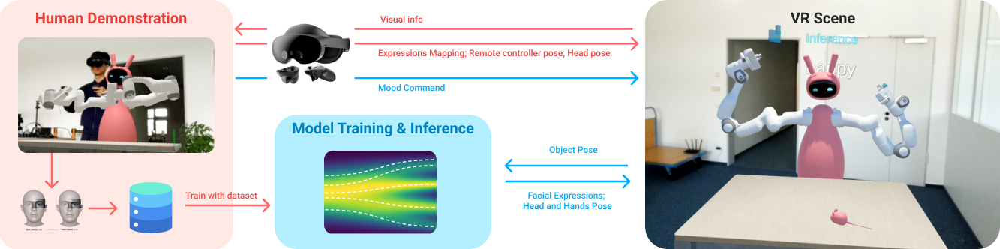

# 🤖🌊 robot manipulation with flow matching

A Webocket server for collecting data and real-time reasoning for `Generation of Real-time Robotic Emotional Expressions Learning from Human Demonstration in Mixed Reality`.
This repo forks the flow-matching model repo for training and inference: https://github.com/HRI-EU/flow_matching.git

* Paper page: Generation of Real-time Robotic Emotional Expressions Learning from Human Demonstration in Mixed Reality. https://arxiv.org/abs/2508.08999
* Project page: https://wallacewangchao.github.io/fm-expressions/
* Code: https://github.com/HRI-EU/flow_matching
* Author: Chao Wang (chao.wang@honda-ri.de)

## Key components
🔬 **This repo contains** \
* A websocket server for collecting data in VR and real-time reasoning.
* Training emotional expression via FM
* An .apk which can be installed on Meta QuestPro for collecting data and observing inference result can be download here: https://drive.google.com/drive/folders/1XDhvuSp9l3wu2Fq6JijWiwktJn3MOONX?usp=sharing

📝 **Acknowledgements** 
* The model structure implementation is modified from Cheng Chi's [diffusion_policy](https://github.com/real-stanford/diffusion_policy) repo. The code is under external/diffusion_policy (MIT license). Some code that we modified is located under external/models.
* We use some functions from Alexander Tong's [TorchCFM](https://github.com/atong01/conditional-flow-matching) repo (MIT license). It is installed through pip.
* Please download the PushT demonstration datat from Google Drive (id=1KY1InLurpMvJDRb14L9NlXT_fEsCvVUq&confirm=t) from Cheng Chi's 
[diffusion_policy](https://github.com/real-stanford/diffusion_policy) repo. 
* Please download the Franka Kitchen demonstration data from Nur Muhammad Shafiullah's 
[Behavior Transformers](https://mahis.life/bet/) repo (MIT license).

## License

This project is licensed under the BSD 3-clause license - see the [LICENSE.md](LICENSE.md) file for details
